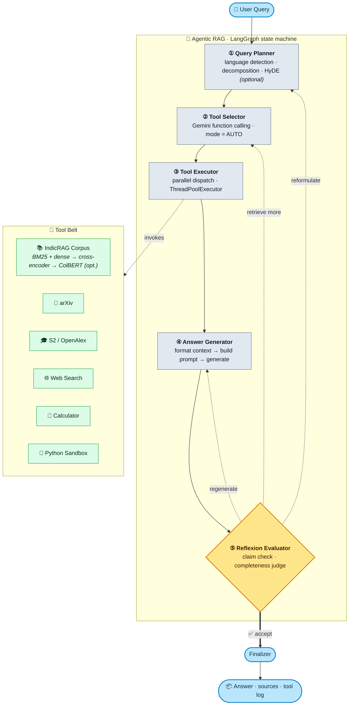

# 🌐 IndicRAG — Multilingual Agentic Scientific RAG

[](https://deepwiki.com/DNSdecoded/IndicRAG)
[](https://codewiki.google/github.com/dnsdecoded/indicrag)
[](https://opensource.org/licenses/MIT)
[](https://www.python.org/downloads/)
[](https://fastapi.tiangolo.com/)
[](https://ai.google.dev/)
[](https://github.com/langchain-ai/langgraph)


A **production-ready** Retrieval-Augmented Generation system with an **agentic pipeline**, multilingual support for 10+ Indian languages, and tools for searching arXiv, Semantic Scholar, OpenAlex, and the web — alongside your own indexed document corpus.

Two pipelines ship side-by-side: **Standard RAG** (single-pass hybrid retrieval) and **Agentic RAG** (multi-tool planning with reflexion self-correction). Answers stream token-by-token over SSE, sessions survive restarts, and every retrieval knob is env-configurable. Now with **multi-provider LLM** support (Gemini + OpenRouter), **topic watches**, and **literature review reports**.

---

## What's New in v2.6 (in progress)

**Theme: bounded, honest serving.** The search indexes are derived views over the
ingest log; v2.6 adds the machinery that verifies that claim, and bounds what the
server takes on before it degrades for everyone.

| Area | v2.5 | v2.6 |
|------|------|------|
| **Index integrity** | Nothing checked the log against the indexes | **Reconciler** (`check_db.py`, `POST /reconcile`) diffs the ingest log against ChromaDB and BM25 per paper; `/quality` reports the result |
| **Delete cascade** | Best-effort, warn-and-continue | **Compensating retry**, then ERROR + `indicrag_cascade_failures_total` — a partial delete is no longer silent |
| **Backup** | None (copying `sessions.db` mid-write tears it) | **`backup.py`** — online SQLite snapshot + manifest; restore replays the log into the indexes |
| **Schema changes** | `_ensure_column()` at import, no record of what ran | **Versioned migrations** recorded in a `schema_migrations` table |
| **Load handling** | Unbounded; heavy queries starved `/health` and job polls | **Admission control** — bounded pools per workload, `429` + `Retry-After`, agents shed first |
| **LLM failover** | Up to 3 attempts x 60s, past the agent's own budget | **Deadline-aware** — an attempt that cannot finish in time is never started |
| **Agent streaming** | Re-chunked a finished answer at 80 chars | **Real token streaming**; the done event carries the citation-corrected answer |
| **SSE under load** | A slow client blocked the producer 30s per chunk | **Drop-oldest chunks**, bounded producer threads — generation never waits on a reader |
| **BM25 deletes** | `df` rescanned per query term against tombstones | **Live `df` counters** + automatic compaction past 20% tombstones |
| **Dedup on ingest** | Scanned every chunk's metadata out of ChromaDB | **`paper_index` mirror** — a papers-sized table, written in the log's own transaction |
| **arXiv enrichment** | Serial, 1s+ per paper, re-crawled every run | **Parallel (3 workers) + cached** in SQLite, misses included |
| **Orphaned HNSW segments** | Accumulated forever (24 dirs / 18 MB measured) | **`purge.py --segments`** reclaims what no live collection references |
| **SQLite** | One connection, one global lock, commit per write | **Per-thread read connections** + `batch_writes()` — WAL is finally worth having |
| **Alerting** | Metrics existed, nobody watched them | **`deploy/alerts.example.yml`** — 8 Prometheus rules over latency, capacity and integrity |
| **Prompts** | Thresholds hardcoded in two places, history untagged | **Config-driven thresholds**, `<history>` / `<contradictions>` sections, grey-literature and empty-context rules |

### v2.6 — new maintenance surface

* **`POST /reconcile`** runs the log-vs-index diff. It walks the whole collection, which is why it is a POST — and why `/quality` reads the cached result rather than triggering a scan.
* **`python check_db.py`** does the same from the command line and exits non-zero on divergence.
* **`python backup.py create | list | restore <file> --yes`** snapshots the system of record. Restoring replays it into the indexes, because a restored log with stale vectors is worse than either snapshot.
* **`python purge.py --segments`** deletes only segment directories Chroma's own metadata does not reference, and refuses to act if that metadata is unreadable.

---

## What's New in v2.5

| Area | v2.4 | v2.5 |
|------|------|------|
| **Default model** | gemini-3.6-flash | **gemini-3.7-flash** — current Flash generation, built for agentic multi-step work |
| **Data isolation** | Advertised, but only jobs enforced it | **Actually enforced** — sessions, watches, feedback, reports and prefs are scoped by API-key fingerprint |
| **BM25** | Linear scan, dropped on every ingest | **Inverted index** (9x faster), incremental add/remove, persisted to disk (8x faster cold start) |
| **Failure modes** | A sick ChromaDB or embedder failed every request | **Circuit breaker + sparse-only degraded mode**, surfaced as a `degraded` response field |
| **Background jobs** | Left `running` forever after a crash | **Leased and reaped** — abandoned jobs are failed at startup with an actionable error |
| **Watch scheduler** | Every worker ran every due watch | **Claimed** via compare-and-set, so replicas cannot duplicate ingests or LLM spend |
| **Index provenance** | Nothing recorded which model made a vector | **Stamped** with model, dimension, backend and chunker version; mismatches reported at startup |
| **Reindexing** | Re-parse every PDF, re-caption every figure | **`reindex.py`** replays an ingest log — reproducible, and works without the source PDFs |
| **Observability** | HTTP latency only | **Per-stage metrics** — retrieval, rerank, NLI, cache hits, tokens, breaker trips, failover hops |
| **Tests** | Every boundary mocked | **+ integration suite** over a real ChromaDB, covering the seams between stages |

### v2.5 — security fixes

* **Cross-user data exposure closed.** `GET /chat` and `GET /chat/{id}` listed and returned *every* user's conversations, and `DELETE /chat/{id}` deleted any of them. `GET /watch` took `user_id` as a query parameter, so omitting it returned all users' watches and supplying someone else's returned theirs. Feedback and report listings had no owner column at all — and the feedback join exposes the original question and answer text. Ownership is now the API-key fingerprint, never client input, and another key's record reads as `404` rather than `403` (a 403 confirms the id exists).
* **SSRF DNS rebinding closed.** The private-IP guard and `urlopen`'s own lookup were two separate DNS queries, so a rebinding resolver could answer public for the check and `169.254.169.254` for the fetch. Resolution now happens once and the connection is pinned to that address; TLS still validates against the hostname.
* **Unbounded LLM spend closed.** `POST /report` and `POST /watch/{id}/run` each start a full LLM workload and had no rate limit; either could drain the shared quota for every other user.
* **Concurrent turns no longer lose each other.** Two requests on one session both read history at length N and both appended, so each answer was blind to the other. A per-session lock now spans read → generate → append.

### v2.5 patch — correctness fixes

* **A timed-out upsert no longer escapes rollback.** The ChromaDB write timeout cannot cancel work already in flight, so a batch that timed out could still commit after the failure handler ran, leaving chunks searchable that no ingest-log record covers. Batch ids are now recorded *before* the call, so rollback covers the in-flight batch.
* **Rollback stopped deleting pre-existing chunks.** A failed batch rolled back every id it had written, including ids that already held content from an earlier ingest — deleting rows the ingest log still records. A pre-flight probe now separates rows this call created (deleted) from rows it overwrote (kept, and logged loudly for re-ingest).
* **A failed watch run no longer wedges the watch forever.** Scheduling read `next_run` from the JSON blob while claiming compared the column, so one failure left the two divergent and every later claim failed. Both are now updated in a single statement.
* **BM25 index integrity.** Misaligned `ids`/`texts` raise instead of being silently truncated by `zip()`; `save_index` snapshots under the index lock; and `invalidate()` deletes the persisted caches, since chunk ids are positional and a reused id would otherwise resurrect stale text.
* **Tags filtering works in degraded mode.** Sparse-only retrieval fetched exactly `top_k` ids and filtered afterwards, so a tag query could come back empty; it now over-fetches and pushes the filter into ChromaDB.
* **The Gemini thinking-config ladder is bounded.** Retries classify the rejection before climbing and cannot loop.
* **SSRF guard inspects every DNS answer**, not just the first.
* **Agent streams hold the session turn lock** for the whole stream, and a disconnect stops the graph instead of letting it run on.

### v2.5 — breaking change

`POST /watch` no longer treats `user_id` as an identity. It is a display label; authorization comes from the API key. Clients that relied on reading another user's watches by passing their `user_id` will now receive `[]` — that is the fix, not a regression.

---

## What's New in v2.4

| Area | v2.3 | v2.4 |
|------|------|------|
| **Default model** | gemini-3.5-flash | **gemini-3.6-flash** — latest Gemini Flash, faster and more capable |
| **Multi-user support** | Single-user API key | **Per-user data isolation** — sessions, watches, feedback, preferences scoped to API key |
| **User preferences** | None | **GET/PUT /prefs/{user_id}** — per-user settings with opt-in `ENABLE_USER_PREFS` |
| **Admin API key** | Falls back to API_KEYS | **Dedicated ADMIN_API_KEY** for destructive /purge/* operations |
| **Session management** | Basic eviction | **Configurable** — `SESSION_MAX_AGE_HOURS`, `CHAT_HISTORY_MAX_TURNS` |
| **Rate limiting** | Per-IP only | **Per-API-key** — each user gets their own rate-limit bucket |
| **Linting** | CI failures on unused imports | **Clean CI** — fixed F401/E401 linting errors |

### v2.4 patch — correctness fixes

* **Faithfulness verification restored** — `verify.check_claims` was passing `(index, text)` tuples to the NLI model instead of the chunk text, so every call raised and every answer reported `confidence: 0.0` with no evidence.
* **Generation restored on `gemini-3.6-flash`** — models that reject `thinking_budget=0` returned `400 INVALID_ARGUMENT`. The Gemini backend now remembers per-model rejections and retries once with the budget translated to a `thinking_level`.
* **Thinking is actually minimised, not defaulted** — the earlier fix dropped `thinking_config` on rejection, which means the model's *own* default (`medium` on `gemini-3.6-flash`), billed and taken out of `LLM_MAX_TOKENS`. New `LLM_THINKING_LEVEL` / `AGENT_THINKING_LEVEL` knobs (default `minimal`) set the level up front.
* **Retrieval cache actually populates** — the cacheability check ran after the collection was materialized, so nothing was ever stored. Cached entries are now copied on both read and write so callers can't mutate them.
* **Tags filter returns results** — tags are stored as one comma-joined metadata string and must be filtered in Python, which needs an over-fetch (`TAGS_OVERFETCH`); without it a tag query returned nothing.
* **Cross-vendor failover is really cross-vendor** — the OpenRouter fallback was handed a bare Gemini model name, which OpenRouter rewrites to `google/<model>`, routing back to the vendor that just failed. It now picks a `/`-shaped slug from `LLM_SELECTABLE_MODELS`.
* **Selected model honoured in agentic answers** — the answer generator used the configured default instead of the requested model.
* **Web UI** — new Retrieval view, Library row actions (dry-run, edit metadata, delete, bulk delete), Depth + tags controls, BibTeX/Markdown evidence exports, saved reports, and an index-health diagnostics panel.

---

## ✨ Key Features

### 🤖 Agentic RAG Pipeline

* **LangGraph state machine** — query planner → tool selector → tool executor → answer generator → reflexion evaluator, with conditional loops
* **6 agent tools:**
  * **indicrag_retrieval** — hybrid BM25 + dense search with cross-encoder reranking on your indexed corpus, with optional **year-range filter**
  * **arxiv_search** — search arXiv by topic, author, or paper ID; returns abstracts, authors, PDF links
  * **open_access_search** — Semantic Scholar with automatic OpenAlex fallback (free, no API key); returns citation counts and open-access PDFs
  * **web_search** — Tavily web search for current events and non-academic info
  * **calculate** — numexpr math evaluation (identifier-whitelisted)
  * **execute_python** — process-isolated Python with AST-based validation (import whitelist, dunder + dangerous-builtin blocking) + 10s timeout
* **Reflexion loops with layered budgets** — the evaluator checks faithfulness (fraction of claims grounded by NLI entailment) and completeness (Gemini Flash). Below threshold it can regenerate, retrieve more, or reformulate — bounded by an iteration cap (3), a loop budget (`AGENT_REFLEXION_BUDGET_S`, iteration 2+), a deadline reserve (`AGENT_EVAL_RESERVE_S`), and a per-call LLM timeout (`LLM_REQUEST_TIMEOUT_S`). Stuck-loop detection auto-accepts when completeness stops improving.
* **Contradiction detection** — NLI-based cross-source contradiction flagging in the answer generator; surfaces both sides with citations when sources disagree
* **Confidence & abstention** — finalizer surfaces a confidence score; low-confidence answers get an explicit abstention prefix with partial sourcing
* **Multi-turn conversations** — session history threaded through `AgentState` so follow-ups resolve pronouns and references
* **Parallel tool execution** — multiple selected tools run concurrently via `ThreadPoolExecutor`
* **Sub-query cap** — `AGENT_MAX_SUB_QUERIES` limits per-cycle retrievals to bound latency and cost
* **Model failover + circuit breaker** — per-(provider, model) circuit keys; one model's 429 doesn't block others. Cross-provider failover (Gemini → OpenRouter, or reverse), with a **guaranteed Gemini backstop** so any selected OpenRouter model still resolves when its free-tier endpoint 429s
* **Multi-provider LLM** — Gemini + OpenRouter (Claude, GPT, Llama, etc.) with user-selectable models, capability gating, and non-Gemini JSON fallback
* **google-genai native function calling** — no LangChain LLM wrappers; `mode=AUTO` lets the model return an empty tool list on `regenerate` actions

### 🔍 Hybrid Retrieval Pipeline

* **Dense + sparse** — BGE-M3 (1024d) fused with a BM25 **inverted index** via Reciprocal Rank Fusion (RRF). Scoring touches only the documents containing a query term, so cost tracks term frequency rather than corpus size (measured on 20k chunks: 25.9 ms → 2.9 ms per query). Updates are incremental — an ingest folds new chunks in instead of dropping the index and making the next query rebuild it (2.93 s → 3.8 ms), and the index persists across restarts
* **Two-stage reranking** — `BAAI/bge-reranker-v2-m3` cross-encoder, with optional **ColBERT** multi-vector MaxSim rerank on the narrowed candidate set
* **Optional HyDE** — generate a hypothetical answer, embed it, and retrieve against it for recall on sparse queries
* **Faithfulness verification** — a multilingual NLI cross-encoder (`NLI_MODEL_NAME`, int8 ONNX on CPU) scores entailment per claim against its cited chunks; unsupported assertions flagged, stripped, or regenerated (`FAITHFULNESS_ENFORCE`). The threshold is **model-specific and calibrated**, not a taste setting — see `FAITHFULNESS_THRESHOLD`
* **Citation integrity** — the answer's `[N]` markers are renumbered to a dense `1..M` matching the cited-only source panel, and markers are resolved against **only the chunks that reached the prompt**. The context is truncated by chunk count and by length, so numbering against everything retrieved let a marker the model invented resolve to a real paper it was never shown — a phantom citation that reads as legitimate. Unresolvable markers are dropped rather than left dangling
* **Graceful degradation** — ChromaDB sits behind a circuit breaker (3 consecutive timeouts → fail fast for 60s), so an unhealthy store cannot make every request pay the full timeout and exhaust the thread pool. An embedding failure degrades to BM25-only rather than failing the query, and the response carries `degraded: "sparse_only"` so a reduced answer is never presented as a normal one
* **HNSW tuning knobs** — `ef_search`, `ef_construction`, `M` all env-configurable

### 📥 Smart Ingestion

* **Section-aware chunking** — per-section chunk sizes (abstract, methods, results, …) instead of uniform splits
* **Multimodal figure/table indexing** — extract figure/table crops from PDFs, generate captions, and embed alongside text chunks
* **Metadata enrichment** — auto-fetch authors, year, DOI from arXiv by fuzzy title match at ingest time
* **Title dedup** — near-duplicate papers rejected by `SequenceMatcher` ratio (`DEDUP_TITLE_THRESHOLD`)
* **MD5 content dedup** + parallel extraction, Indic-aware chunking
* **Index provenance** — every chunk records the embedding model, dimension, backend (`fp32` / `fp16` / `onnx-int8`) and chunker version that produced it. Cosine distance between two embedding spaces is meaningless but never raises, so a model swap otherwise shows up only as retrieval quality quietly getting worse; mismatches are reported at startup instead
* **Replayable ingest log** — each ingestion records the chunks it produced, making the vector and lexical indexes derived views. `reindex.py` rebuilds them from that log without re-parsing PDFs or re-captioning figures, which is what turns an embedding-model change from an unreproducible afternoon into a routine replay

### 🌍 True Multilingual Support

* **10+ Indian languages** + English (Hindi, Tamil, Telugu, Bengali, Marathi, Gujarati, Kannada, Malayalam, Punjabi, Odia, Urdu)
* Unicode script-based language detection with Devanagari hi/mr disambiguation
* **Two RAG strategies:** Direct multilingual reasoning (A, recommended) or Translation-enhanced with NLLB-200 (B, sentence-batched)
* Cross-lingual semantic search via BGE-M3

### 🛡️ Production-Ready Infrastructure

* **SQLite session/job persistence** — restarts don't drop in-flight state (`SESSIONS_DB_PATH`)
* **Leased jobs, reaped on restart** — jobs heartbeat while running, and startup fails the ones whose lease expired. A crash used to leave the row saying `running` forever while clients polled a job that no longer existed in any process. Reaping on an expired lease (rather than "not started by me") keeps it safe with multiple workers: a live worker's jobs are never taken from under it
* **Claimed watch scheduling** — the schedule loop runs in-process, so every worker sees the same watch as due. A compare-and-set claim means only one runs it, instead of each replica repeating the arXiv fetch, the ingest and the digest spend
* **SSE streaming** — token-by-token answers and live ingest progress; the `done` event carries the citation-corrected answer, since chunks stream before numbering can be resolved
* Thread-safe model init (double-checked locking on all singletons)
* Startup warm-up via FastAPI lifespan (embeddings, vector store, reranker, BM25) — no cold first request
* Request-ID correlation across log lines
* **Per-stage Prometheus metrics** — `indicrag_stage_seconds` across dense retrieval, BM25, ColBERT, cross-encoder and NLI, plus counters for cache hits, LLM tokens, failover hops, breaker trips, reflexion iterations and answer outcomes. Route-level latency answers "is /query slow"; these answer "why". Timing is recorded on the error path too, since a stage that fails after 30s is the one worth seeing
* API-key auth with per-key data isolation, env-driven CORS, Pydantic v2 validation, path-traversal + URL-scheme guards
* **SSRF-hardened outbound fetches** — scheme allow-list, DNS resolved once with the connection pinned to that address (closing the rebinding window), per-hop redirect re-validation, and a 50 MB streaming cap. TLS still validates against the hostname, not the pinned IP
* **int8 quantized ONNX** cross-encoders for CPU — lower memory, faster inference (~3x reranker, ~11x NLI). Optionally the embedding model too (`EMBED_ONNX_INT8`), though that one is more modest (see `EMBED_ONNX_INT8` in the configuration table) and shifts every vector, so it ships off
* **Tested across the seams** — an integration suite runs a real ChromaDB through ingest, retrieval, citation compaction, caching and delete consistency. The unit suite mocks every boundary, and all three v2.4 correctness bugs lived in the seams between stages, where a mock cannot reach

### 📡 Topic Watches & Literature Reports

* **Topic watches** (`/watch/*`) — persistent monitoring with daily/weekly/monthly cadence; background digest loop fetches new papers, summarizes, and stores results
* **Literature review reports** (`/report/*`) — async decomposition of a topic into sections, cited synthesis from the corpus, and downloadable Markdown artifact
* **Model selection** (`GET /models`) — curated allowlist enriched with OpenRouter tool-capability metadata; UI dropdown with badges
* **Chat history** — endpoints + UI panels for browsing past conversations and topic watches

### 🗄️ Three-Layer Caching + Gemini Prompt Cache

* **LLM response cache** (128 entries, 10 min TTL) — identical prompts skip the API
* **Retrieval cache** (64 entries, 5 min TTL) — auto-invalidated on ingest
* **Tool result cache** (64 entries, 3 min TTL) — shared across reflexion loops
* **Explicit Gemini prompt caching** (opt-in) — caches the stable system-instruction prefix per API key
* All sizes/TTLs env-configurable; `GET /cache/stats` for observability

---

## 🚀 Quick Start

### Prerequisites

* Python 3.11+
* Google Gemini API key ([Get one here](https://aistudio.google.com/api-keys))
* 8GB+ RAM recommended
* (Optional) Tavily API key for agent web search ([Get one here](https://app.tavily.com))

### Installation

```bash
git clone https://github.com/DNSdecoded/IndicRAG.git
cd IndicRAG

python -m venv .venv
# Windows
.venv\Scripts\activate
# macOS/Linux
source .venv/bin/activate

pip install -r requirements.txt
```

### Configuration

```bash
cp .env.example .env
```

Edit `.env`:

```ini
# Required
LLM_API_KEY=your_gemini_api_key_here

# Optional — enables multi-provider mode (OpenRouter)
# OPENROUTER_API_KEY=your_openrouter_key_here
# LLM_PROVIDER=gemini          # gemini|openrouter
# LLM_FALLBACK_PROVIDER=openrouter

# Optional — enables agent web search tool
TAVILY_API_KEY=your_tavily_key_here

# Optional — higher token limit for agent answers (default 8192)
AGENT_MAX_TOKENS=8192

# Optional — thinking level (Gemini 3.x): minimal|low|medium|high, empty = model default
# Empty is not neutral: the model then thinks at its own default (medium), out of
# LLM_MAX_TOKENS. Not every model offers every level — gemini-3.7-flash rejects
# minimal, and the backend escalates one level up rather than failing the call.
LLM_THINKING_LEVEL=minimal
AGENT_THINKING_LEVEL=minimal

# Legacy — agent thinking tokens on models that still accept a budget:
# 0=off (cheapest), -1=dynamic, N=cap (default 0). Gemini 3.x translates it to a level.
AGENT_THINKING_BUDGET=0

# Optional — retrieval quality boosters (off by default, cost more compute)
USE_COLBERT_RERANK=false
USE_HYDE=false

# Optional — topic watches and literature reports (off by default)
# WATCH_ENABLE=true
# REPORT_ENABLE=true
```

### Ingest Documents

```bash
# Place PDFs in papers/ directory, then:
python ingest.py

# Or specify a directory:
python ingest.py path/to/pdfs
```

### Start Server

```bash
python start_server.py

# Development mode with auto-reload
python start_server.py --dev
```

Access at:
* **Web Interface:** http://localhost:8080
* **API Docs:** http://localhost:8080/api/docs

---

## 📖 Usage

### 🖥️ Web UI

Open http://localhost:8080:

**Ask** — pick a pipeline mode (Standard RAG or Agentic RAG), a strategy (Direct Multilingual `A` or English Pivot `B`), a model from the allowlist, and ask in English or any supported Indic language. The composer also exposes **Depth** (`top_k` = 4/8/12/16/20), a **scope** selector, and a **tags** filter. Agentic mode ignores scope, tags, and depth — the UI says so inline.

**Retrieval** — retrieval-only view over `POST /search`: query the corpus, the web, or both at k = 5/10/20/30 and inspect the raw passages with no LLM in the loop. Results export to BibTeX.

**Library** — upload and ingest PDFs, plus per-row actions: ingest, **dry-run** (preview chunking/dedup before writing), **edit metadata** (title, authors, year, tags via `PATCH /papers/{id}`), and delete. Multi-select supports bulk delete.

**Evidence exports** — answers export their cited sources as **BibTeX** or **Markdown**.

**History** — sessions persist across restarts and can be reopened or deleted individually.

**Reports** — saved literature reviews are listed and reopenable, rendered as Markdown with a download button.

**Index health** — a diagnostics panel showing deep health, cache stats, index quality signals, and submitted feedback, with a one-click cache clear.

In Agentic mode the UI shows an animated progress stepper with elapsed timer, color-coded source cards (title, authors, year, citation count, PDF link), a tool-call log with latencies, and copy buttons on answers and LaTeX equations.

### 🔌 REST API

#### Streaming Query — `POST /query/stream`

```python
import requests

with requests.post('http://localhost:8080/query/stream',
                   json={"question": "What are the latest advances in antenna optimization using ML?"},
                   stream=True) as r:
    for line in r.iter_lines():
        if line:
            print(line.decode())  # Server-Sent Events
```

**Use the `done` event's `answer`, not the concatenated chunks.** Chunks are emitted as the model produces them, so they carry its raw `[N]` markers. The `done` event carries the *compacted* answer — citations renumbered to a dense `1..M` matching the source panel, and markers that resolve to nothing removed. Concatenating the chunks yields text whose numbering disagrees with `citations` (an answer drawing on papers 1 and 4 of 4 streams as `[1] … [4]` beside a two-entry panel).

| SSE event | Fields |
|---|---|
| `chunk` | `text` — raw answer fragment, streamed live |
| `done` | `answer` (compacted), `citations`, `language`, `query_id`, `session_id` (chat only) |
| `error` | `message` |

#### Standard Chat — `POST /chat`

```python
r = requests.post('http://localhost:8080/chat', json={
    "message": "యాంటెన్నాతో ml ను ఎలా అమలు చేయవచ్చు?",
    "strategy": "A"
})
print(r.json()['answer'])
```

#### Agentic Query — `POST /agent/query`

```python
r = requests.post('http://localhost:8080/agent/query', json={
    "question": "What are the latest advances in antenna optimization using ML?",
    "strategy": "A"
})

data = r.json()
print(data['answer'])
print(f"Sources: {len(data['sources'])}  Reflexion iterations: {data['reflexion_iterations']}")
for src in data['sources']:
    print(f"  [{src['section']}] {src['title']} ({src['year']}) — {src['citations']} citations")
    if src.get('pdf_url'):
        print(f"    PDF: {src['pdf_url']}")
```

**Agent response fields:** `answer`, `language`, `sources` (title/authors/year/citations/pdf_url/url), `tool_calls` (name/args/latency_ms), `reflexion_iterations` (0–3), `processing_time`.

---

## 🔧 API Reference

| Endpoint | Method | Description |
|----------|--------|-------------|
| `/query` | POST | Single-turn question answering |
| `/query/stream` | POST | Same, streamed token-by-token (SSE) |
| `/chat` | POST | Multi-turn chat with persisted session history |
| `/chat/stream` | POST | Streamed multi-turn chat (SSE) |
| `/chat/{session_id}` | DELETE | Clear a chat session (owner only) |
| `/chat` | GET | List **your own** persisted chat sessions |
| `/chat/{session_id}` | GET | Fetch one session's history (owner only; other keys get 404) |
| `/agent/query` | POST | Agentic pipeline with reflexion loops (timeout → 504) |
| `/agent/stream` | POST | Agentic pipeline, streamed step-by-step (SSE) |
| `/reconcile` | POST | Diff the ingest log against ChromaDB + BM25 (v2.6) |
| `/compare` | POST | Kick off a multi-model answer comparison (async, returns `job_id`) |
| `/compare/status/{job_id}` | GET | Comparison job status / results |
| `/models` | GET | Curated model allowlist with tool-capability metadata |
| `/search` | POST | Retrieval-only — corpus, web, or both (no LLM) |
| `/search/export` | GET | Export retrieved papers as BibTeX (`format=bibtex` only) |
| `/export/bibtex` | POST | Export an answer's cited sources as BibTeX |
| `/upload` | POST | Upload PDF (multipart form) |
| `/ingest` | POST | Ingest one PDF into the vector store |
| `/ingest/all` | POST | Bulk ingest all PDFs (async, returns `job_id`) |
| `/ingest/status/{job_id}` | GET | Bulk ingest job status |
| `/ingest/stream/{job_id}` | GET | Live ingest progress (SSE) |
| `/ingest/dry-run` | POST | Preview chunking/dedup without writing |
| `/ingest/reindex` | POST | Rebuild the index from stored papers |
| `/ingest/from-url` | POST | Fetch a PDF by URL and ingest it |
| `/ingest/health` | GET | Deep ingest-path health (store, embeddings, disk) |
| `/papers` | GET | List uploaded PDFs |
| `/papers/{paper_id}` | PATCH | Edit paper metadata (title, authors, year, tags) |
| `/papers/{paper_id}` | DELETE | Delete a single paper |
| `/watch` | GET/POST | List or create topic watches (scoped to your key; `user_id` is a label) |
| `/watch/{id}` | GET/DELETE | Read or delete a watch (owner only) |
| `/watch/{id}/run` | POST | Trigger a watch run immediately — **rate-limited 5/min** (spends LLM budget) |
| `/watch/{id}/digest` | GET | Fetch persisted digest for a watch |
| `/report` | POST | Kick off a literature review report — **rate-limited 5/min** (spends LLM budget) |
| `/report/status/{job_id}` | GET | Report generation status |
| `/report/{job_id}/download` | GET | Download completed report (Markdown) |
| `/reports` | GET | List **your own** saved reports |
| `/reports/{report_id}` | GET | Fetch one saved report (owner only) |
| `/feedback` | POST | Submit answer feedback |
| `/feedback` | GET | List **your own** feedback, joined with its query context |
| `/feedback/stats` | GET | Aggregate feedback counts for your key |
| `/prefs/{user_id}` | GET / PUT | Read / update preferences (stored against your key, not the path label) |
| `/stats` | GET | Vector store statistics |
| `/quality` | GET | Index quality signals (chunk/metadata coverage) |
| `/cache/stats` | GET | Cache hit rates, sizes, TTL config |
| `/cache` | DELETE | Clear all caches |
| `/health` | GET | Health check (`?deep=true` for component checks) |
| `/metrics` | GET | Prometheus metrics incl. per-stage timings (API key required) |
| `/purge/papers` | DELETE | Delete all PDFs (admin key) |
| `/purge/database` | DELETE | Clear vector database (admin key) |

### Ownership and scoping

Every read and delete listed above is scoped by a SHA-256 fingerprint of the caller's
`X-API-Key`. A record owned by another key responds `404`, never `403` — a 403 would
confirm the id exists. Records written before scoping existed carry no owner and are
not visible to ordinary keys.

When `API_KEYS` is unset the server is single-tenant, there is nothing to scope
against, and all records are visible to the anonymous caller.

### Response fields added in v2.5

| Field | Where | Meaning |
|---|---|---|
| `degraded` | `QueryResponse`, `ChatResponse`, SSE `done` event | `null` normally. `"sparse_only"` means the dense retrieval leg was unavailable and the answer came from BM25 alone — lower quality, and clients should say so rather than presenting it as a normal answer. |

---

## 📁 Project Structure

> Full annotated tree: [PROJECT_STRUCTURE.md](PROJECT_STRUCTURE.md)

```
IndicRAG/
│
├── 📄 Root
│   ├── requirements.txt             # dependencies
│   ├── .env.example                 # LLM_API_KEY(S), TAVILY, AGENT_MAX_TOKENS, ...
│   ├── start_server.py              # Launcher with pre-flight checks
│   ├── patterns.json                # Regex patterns for PDF cleaning
│   ├── backup.py                    # Online DB snapshot + restore-and-replay
│   └── check_db.py                  # Log-vs-index reconciler (CLI + /reconcile)
│
├── 🐍 Core Modules
│   ├── config.py                    # Configuration + env parsing (VERSION = 2.6.0-dev)
│   ├── api_server.py                # FastAPI app: lifespan warm-up + router mounting
│   ├── deps.py                      # Shared deps: auth, rate limit, session/job state
│   ├── middleware.py                # Request-ID propagation
│   ├── persistence.py               # SQLite session/job/watch/report persistence
│   ├── llm_client.py                # Multi-provider dispatcher: Gemini + OpenRouter
│   ├── gemini_cache.py              # Explicit Gemini prompt caching (per client)
│   ├── rag.py                       # RAG pipeline orchestration
│   ├── sse_utils.py                 # Shared SSE streaming bridge
│   ├── embeddings.py                # BGE-M3 embeddings (thread-safe)
│   ├── vector_store.py              # ChromaDB wrapper (HNSW knobs)
│   ├── bm25_search.py               # BM25 + RRF fusion
│   ├── rerank.py                    # Cross-encoder reranker (int8 ONNX)
│   ├── onnx_ce.py                   # int8 quantized ONNX cross-encoder inference
│   ├── colbert_rerank.py            # ColBERT multi-vector MaxSim rerank (opt-in)
│   ├── verify.py                    # NLI faithfulness verification
│   ├── contradiction.py             # Cross-source contradiction detection (Phase 5)
│   ├── lang_utils.py                # Unicode script + langdetect
│   ├── pdf_utils.py                 # PDF extraction, Indic-aware chunking
│   ├── figure_captioner.py          # Figure/table crop extraction + captioning (Phase 3)
│   ├── metadata_enrich.py           # arXiv metadata auto-fetch at ingest
│   ├── ingest.py                    # Section-aware parallel ingestion + dedup
│   ├── translation.py               # NLLB-200 sentence-batched (Strategy B)
│   ├── cache.py                     # Thread-safe TTL LRU cache (LLM/retrieval/tool)
│   ├── watch_runner.py              # Background topic-watch digest loop
│   ├── report_runner.py             # Async literature-review report generation
│   ├── purge.py                     # CLI cleanup (papers, db, models)
│   ├── reindex.py                   # Rebuild indexes by replaying the ingest log
│   └── metrics.py                   # Per-stage Prometheus timings and counters
│
├── 🔌 providers/                     # LLM provider backends
│   ├── base.py                      # LLMBackend interface
│   ├── gemini.py                    # GeminiBackend — google-genai native
│   └── openrouter.py                # OpenRouterBackend — OpenAI-compatible API
│
├── 🌐 routes/                       # FastAPI routers
│   ├── query.py                     # /query, /query/stream, /health, /
│   ├── chat.py                      # /chat, /chat/stream, /chat/{id}
│   ├── agent.py                     # /agent/query
│   ├── ingest.py                    # /ingest*, /upload
│   ├── management.py                # /search, /papers, /stats, /cache, /purge
│   ├── feedback.py                  # /feedback, /prefs/{user_id}
│   ├── models.py                    # /models — curated model allowlist
│   ├── watch.py                     # /watch — topic monitoring CRUD + run + digest
│   └── report.py                    # /report — literature review generation
│
├── 🤖 agent/                        # Agentic RAG Pipeline
│   ├── state.py                     # AgentState + ReflexionFeedback schemas
│   ├── tool_declarations.py         # 6 google-genai FunctionDeclarations
│   ├── tool_executor.py             # Tool impls: corpus, arXiv, S2/OpenAlex, web, calc, sandbox
│   ├── graph.py                     # LangGraph StateGraph + reflexion routing
│   ├── json_utils.py                # Robust LLM JSON parsing
│   └── nodes/
│       ├── query_planner.py         # Language detection + decomposition (+ HyDE)
│       ├── tool_selector.py         # Gemini function calling
│       ├── tool_executor_node.py    # Dispatch + context accumulation + audit log
│       ├── answer_generator.py      # Reuses rag context/prompt/generate + contradiction detect
│       ├── reflexion_evaluator.py   # check_claims() + Gemini completeness judge
│       └── finalizer.py             # Terminal node — confidence + abstention
│
├── 🌐 static/index.html             # SPA: mode toggle, stepper, source cards, model dropdown, copy buttons
├── 📚 docs/                         # ARCHITECTURE, DEPLOYMENT, evaluation, Eval/, ...
├── 💡 examples/                     # example_ingest.py, example_query.py
├── 🔧 deploy/                       # nginx.example.conf
│
└── 📊 Data (git-ignored)
    ├── papers/                      # PDF documents
    ├── figures/                     # Extracted figure/table crops (Phase 3)
    ├── chroma_db/                   # Vector database
    ├── sessions.db                  # Persisted sessions/jobs/watches
    └── models/                      # Cached ML models
```

---

## ⚙️ Configuration

Key settings (all overridable via environment variables):

| Variable | Default | Description |
|----------|---------|-------------|
| `LLM_API_KEY` | (required) | Google Gemini API key (comma-separate for a round-robin pool) |
| `LLM_PROVIDER` | `gemini` | Primary LLM provider: `gemini` or `openrouter` |
| `LLM_FALLBACK_PROVIDER` | `openrouter` | Cross-provider failover when the primary is down |
| `OPENROUTER_API_KEY` | (none) | OpenRouter API key for multi-provider mode |
| `LLM_MODEL_NAME` | `gemini-3.7-flash` | Gemini model for generation |
| `LLM_FALLBACK_MODEL` | `gemma-4-26b-a4b-it` | Fallback when primary is overloaded (503/429) |
| `LLM_SELECTABLE_MODELS` | `gemini-3.7-flash,gemini-3.6-flash,gemini-3.5-flash-lite,nvidia/nemotron-3-super-120b-a12b:free,google/gemma-4-31b-it:free` | Curated model dropdown (comma-separated; first entry is the default). `.env.example` ships a wider free-tier list. Bare name → Gemini, `/` slug → OpenRouter — **keep at least one `/` slug**, since cross-vendor failover picks the first one here |
| `LLM_MAX_TOKENS` | `8192` | Max tokens for standard RAG (covers thinking + answer) |
| `AGENT_MAX_TOKENS` | `8192` | Max tokens for agentic pipeline |
| `AGENT_TIMEOUT` | `300` | Agent pipeline timeout (seconds) → 504. Must leave room for `AGENT_EVAL_RESERVE_S`, or verification is skipped on every run |
| `LLM_REQUEST_TIMEOUT_S` | `60` | Per-request HTTP timeout for non-streaming LLM calls. Without it the SDK defaults apply (OpenAI: 600s × 2 retries) and one stalled request outlives the whole agent budget — multiplied by the 3-attempt failover chain |
| `LLM_STREAM_TIMEOUT_S` | `300` | Same, for **streamed** calls. Separate because the timeout covers the whole stream rather than the gap between chunks — sharing the unary value cuts long answers off mid-generation |
| `AGENT_REFLEXION_BUDGET_S` | `90` | Wall-clock budget for reflexion **loops** — blocks starting another cycle, from iteration 2 onwards |
| `AGENT_EVAL_RESERVE_S` | `90` | Room that must remain under `AGENT_TIMEOUT` to attempt an evaluation at all. Can skip iteration 1, but only when finishing would overrun the timeout and discard the draft |
| `AGENT_THINKING_BUDGET` | `0` | **Legacy.** Agent thinking tokens: `0`=off, `-1`=dynamic, `N`=cap. Gemini 3.x models reject this field; the backend translates it to a level |
| `LLM_THINKING_LEVEL` | `minimal` | Thinking level for standard RAG — the Gemini 3.x control. `minimal`, `low`, `medium`, `high`, or empty to accept the model default. **Not neutral:** the model's own default is `medium`, and those thought tokens come out of `LLM_MAX_TOKENS`, squeezing the answer. Not every model offers every level — `gemini-3.7-flash` rejects `minimal`; the backend learns that per model and escalates one level up rather than failing |
| `AGENT_THINKING_LEVEL` | `minimal` | Same, for the agentic pipeline |
| `AGENT_MAX_SUB_QUERIES` | `3` | Cap per-cycle retrievals to bound latency |
| `COMPLETENESS_ACCEPT` | `0.75` | Completeness the reflexion evaluator must see to accept an answer. Was hardcoded twice — in the prompt and in the gate — so tuning one silently disagreed with the other |
| `LLM_MIN_ATTEMPT_S` | `20` | Least remaining budget a deadline-aware caller will start another failover attempt with. Below it the chain stops and hands the time back |
| `QUERY_CONCURRENCY` | `8` | Concurrent `/query`, `/chat` and `/compare` requests. Beyond it, callers wait `ADMISSION_WAIT_S` and then get `429` |
| `AGENT_CONCURRENCY` | `4` | Same for `/agent/*`. Smaller on purpose: agents are the expensive shape, so they shed first |
| `ADMISSION_WAIT_S` | `5` | How long a request may wait for an admission slot before being shed |
| `ADMISSION_RETRY_AFTER_S` | `10` | `Retry-After` hint sent with a shed request |
| `SSE_MAX_PRODUCERS` | `16` | Concurrent SSE producer threads. Each holds a provider connection, so unbounded threads let slow clients pin the upstream API |
| `ENRICH_WORKERS` | `3` | Parallel arXiv metadata lookups during a bulk ingest. Deliberately small — arXiv is a shared public service |
| `CONTRADICTION_DETECT_ENABLE` | `false` | NLI-based cross-source contradiction flagging |
| `CONTRADICTION_NLI_THRESHOLD` | `0.6` | NLI score threshold for contradiction detection |
| `TAVILY_API_KEY` | (optional) | Enables agent web search tool |
| `WATCH_ENABLE` | `false` | Enable topic watch endpoints (`/watch/*`) |
| `WATCH_DEFAULT_CADENCE` | `weekly` | Default watch cadence: `daily`, `weekly`, or `monthly` |
| `WATCH_MAX_RESULTS` | `10` | Papers fetched per watch run |
| `REPORT_ENABLE` | `false` | Enable literature review report endpoints (`/report/*`) |
| `REPORT_MAX_SECTIONS` | `6` | Cap report sections to bound cost/latency |
| `USE_HYBRID_SEARCH` | `true` | BM25 + dense fusion |
| `USE_RERANKER` | `true` | Cross-encoder reranking |
| `USE_COLBERT_RERANK` | `false` | ColBERT multi-vector rerank layer |
| `COLBERT_WEIGHT` | `0.5` | Dense-vs-ColBERT fusion weight |
| `USE_HYDE` | `false` | Hypothetical document embeddings |
| `EMBEDDING_MODEL_NAME` | `BAAI/bge-m3` | Sentence-transformer used for dense vectors (1024d) |
| `TAGS_OVERFETCH` | `10` | Multiplier applied to `top_k` when a tags filter is active — tags live in one comma-joined metadata string, so filtering happens in Python after retrieval and the search must over-fetch to avoid returning nothing |
| `TAGS_OVERFETCH_MAX` | `300` | Hard ceiling on that widened fetch |
| `AGENT_MAX_CONTEXT_CHUNKS` | `20` | Chunk cap for the agentic answer prompt |
| `AGENT_MAX_CONTEXT_LENGTH` | `80000` | Character cap for the agentic answer prompt |
| `SCOPED_MAX_CHUNKS` | `50` | Chunk cap when a query is scoped to specific papers |
| `SCOPED_MAX_CONTEXT_LENGTH` | `120000` | Character cap for scoped queries |
| `ENRICH_METADATA` | `true` | Auto-fetch arXiv metadata at ingest |
| `DEDUP_PAPERS` | `true` | Reject near-duplicate titles |
| `DEDUP_TITLE_THRESHOLD` | `0.9` | Title similarity cutoff for dedup |
| `EMBED_ONNX_INT8` | `false` | int8 ONNX embeddings on CPU. 1.4x on a small synthetic batch, **1.9x on a real bulk ingest** (batch 32, long chunks) — an 84-minute corpus embed dropped to ~45. But it shifts every vector (cosine ~0.987 vs fp32), so near-neighbours can reorder and retrieval may change. Switching requires re-embedding the whole corpus; every chunk records its backend so a mixed one is flagged at startup. Opt in deliberately, ideally with a working eval gate |
| `TORCH_NUM_THREADS` | `4` | Caps torch/ONNX intra-op threads; `0` leaves library defaults alone. The process already runs several pools, and each library otherwise takes one thread per core. Raise it (or set `0`) for a bulk ingest on a many-core box, where one job wants everything |
| `BM25_PERSIST` | `true` | Save the BM25 index to disk so a restart skips the rebuild (8x faster cold start). Validated against the live document count and ignored when stale |
| `BM25_CACHE_DIR` | `chroma_db/` | Where that index cache lives |
| `JOB_LEASE_SECONDS` | `900` | How long an in-flight job's lease survives without a heartbeat. Only has to exceed the gap *between* progress updates, not the job's total runtime |
| `WATCH_LEASE_SECONDS` | `3600` | How long a claimed watch is parked before becoming due again. Must exceed a real run, and bounds how long a watch stalls if its claimer dies |
| `FIGURE_CAPTION_WORKERS` | `4` | Concurrent VLM caption calls per paper; `1` restores sequential. Keep small — unbounded fan-out trades slow ingest for 429s |
| `HNSW_EF_SEARCH` | `100` | ChromaDB HNSW query-time search breadth |
| `HNSW_EF_CONSTRUCTION` | `100` | HNSW build-time breadth (index quality vs. ingest speed) |
| `HNSW_M` | `16` | HNSW graph connectivity |
| `FAITHFULNESS_ENFORCE` | `warn` | `warn`, `strip`, or `regen` |
| `FAITHFULNESS_THRESHOLD` | `0.15` | Per-claim entailment probability above which a claim counts as grounded. **Model-specific — recalibrate if you change `NLI_MODEL_NAME`.** Measured for the default model: a sentence copied verbatim out of its own chunk scores median 0.226 / max 0.428; an unrelated paper's sentence median 0.099 / p90 0.158. A 0.5 bar sits above every positive, so faithfulness reads ~0 for every answer |
| `AGENT_FAITHFULNESS_ACCEPT` | `0.6` | Fraction of claims that must be grounded for reflexion to accept and for the finalizer to abstain on completeness alone. Below 1.0 by design: per-claim recall is ~0.70, so a fully grounded answer lands near 0.70 |
| `NLI_MODEL_NAME` | `MoritzLaurer/mDeBERTa-v3-base-xnli-multilingual-nli-2mil7` | NLI model backing faithfulness + contradiction checks |
| `NLI_ENTAILMENT_INDEX` | `0` | Index of the entailment label in that model's output — change if you swap models |
| `NLI_MAX_SEQ_LENGTH` | `256` | Premise truncation. NLI cost is linear in length: 1.15s/pair at 512 tokens vs 0.4s at 256 on CPU, with no measured quality cost |
| `NLI_MAX_CHUNKS_PER_CITATION` | `2` | Chunks scored per cited paper. Uncapped, one answer cost ~275 pairs = 318s in a single reflexion pass |
| `GEMINI_CACHE_ENABLED` | `false` | Explicit Gemini prompt caching |
| `GEMINI_CACHE_TTL` | `3600` | Prompt cache lifetime (seconds) |
| `SESSIONS_DB_PATH` | `sessions.db` | SQLite path for session/job/watch persistence |
| `ENABLE_USER_PREFS` | `false` | Enable `/prefs` user preferences |
| `SESSION_MAX_AGE_HOURS` | `24` | Max session age before eviction (hours) |
| `CHAT_HISTORY_MAX_TURNS` | `20` | Max conversation turns per session |
| `ADMIN_API_KEY` | (none) | Required for `/purge/*` endpoints — fail-closed: with no value set, those routes return 403 for everyone, and an ordinary `API_KEYS` entry never authorizes them |
| `API_KEYS` | (none) | Comma-separated keys for request auth (each key = isolated user) |
| `CORS_ORIGINS` | localhost | Comma-separated allowed origins |
| `LLM_CACHE_SIZE` / `LLM_CACHE_TTL` | `128` / `600` | LLM response cache |
| `RETRIEVAL_CACHE_SIZE` / `RETRIEVAL_CACHE_TTL` | `64` / `300` | Retrieval cache |
| `TOOL_CACHE_SIZE` / `TOOL_CACHE_TTL` | `64` / `180` | Agent tool cache |

---

## 🎯 Supported Languages

| Language | Code | Native Name | Language | Code | Native Name |
|----------|------|-------------|----------|------|-------------|
| English | en | English | Kannada | kn | ಕನ್ನಡ |
| Hindi | hi | हिंदी | Malayalam | ml | മലയാളം |
| Telugu | te | తెలుగు | Punjabi | pa | ਪੰਜਾਬੀ |
| Tamil | ta | தமிழ் | Odia | or | ଓଡ଼ିଆ |
| Bengali | bn | বাংলা | Urdu | ur | اردو |
| Marathi | mr | मराठी | Gujarati | gu | ગુજરાતી |

---

## 🏗️ Architecture

The system runs in two modes: a full **Agentic RAG** loop (below) and a lightweight **Standard RAG** fast path.



### 🔒 Loop guardrails

| Guard | Behavior |
|---|---|
| **Iteration cap** | Max **3** reflexion cycles |
| **Loop budget** | `AGENT_REFLEXION_BUDGET_S` — blocks starting another cycle, from iteration 2 onwards. Deliberately does *not* gate the first evaluation: on a CPU-only box the first pass alone runs past it, so gating iteration 1 would ship every answer with no faithfulness score and no confidence |
| **Deadline reserve** | `AGENT_EVAL_RESERVE_S` — skips the evaluation entirely when too little remains under `AGENT_TIMEOUT` to finish it, since being killed mid-evaluation discards the draft and 504s |
| **Per-call timeout** | `LLM_REQUEST_TIMEOUT_S` bounds each LLM request. Note it bounds one *attempt*, not the failover chain — three stalled attempts still take ~180s, which the deadline reserve absorbs |
| **Stuck-loop detection** | Auto-accepts once completeness stops improving |

### ⚡ Standard RAG mode

Skips the agent graph entirely — a single pass:

```
Query ──▶ Hybrid retrieval (BM25 + dense → rerank) ──▶ Generate
```

---

## 📊 Performance

Typical query latency (on CPU):

| Mode | Latency | Notes |
|------|---------|-------|
| Standard RAG (Strategy A) | ~1–2s | Single-pass |
| Standard RAG (Strategy B) | ~3–6s | Includes NLLB translation |
| Agentic RAG (1 reflexion) | ~2–4 min | Measured on a CPU-only box: ~45s retrieval (3 sub-queries, embed + rerank), ~50s generation, ~25s evaluation (NLI 20s / ~23 claims + completeness call). Tools run in parallel but contend for the same CPU |
| Agentic RAG (max reflexions) | bounded by `AGENT_TIMEOUT` | Loop budget stops further cycles; the draft is returned rather than discarded |

On CPU the agent is dominated by the cross-encoders, not the LLM. The levers, cheapest first: lower `AGENT_MAX_SUB_QUERIES` (near-linear — the parallel retrievals thrash one CPU), add keys to `LLM_API_KEYS` so an exhausted model doesn't cost a failed call plus fallback on every step, and drop `NLI_MAX_CHUNKS_PER_CITATION` to `1`. A GPU removes most of this.

Memory: base ~500MB · +BGE-M3 ~2.5GB · +reranker ~3.5GB · +NLLB (Strategy B) ~6GB. ColBERT rerank adds ~1GB when enabled.

---

## 📈 KPI Metrics

| Metric | Score | Metric | Score |
|--------|-------|--------|-------|
| Retrieval Precision | 0.93 | Technical Depth | 0.88 |
| Retrieval Recall | 0.91 | Mechanistic Reasoning | 0.86 |
| Faithfulness (Grounding) | 0.98 | Cross-Document Discipline | 0.95 |
| Attribution Accuracy | 0.97 | Hallucination Rate | < 2% |

See [docs/evaluation.md](docs/evaluation.md) for methodology.

---

## 🐛 Troubleshooting

**"API key not configured"** — check `.env`: `grep LLM_API_KEY .env`

**"No documents indexed"** — run `python ingest.py`

**Agent web search fails** — ensure `TAVILY_API_KEY` is set in `.env`

**Agent answers truncated** — raise `AGENT_MAX_TOKENS` (e.g. `16384`)

**"Agent pipeline timed out"** — every node logs its wall time as `[Graph] <node> took Ns`; read those before changing knobs. On CPU the usual culprit is retrieval or the NLI pass, not the LLM. If a single LLM call hangs, lower `LLM_REQUEST_TIMEOUT_S` so failover fires sooner — but not below ~60s, since agent answer generation is a unary call measured at 20–50s on CPU and would start aborting legitimately. Raising `AGENT_TIMEOUT` only delays the error

**Faithfulness reads ~0 on every answer** — the threshold is calibrated per NLI model. If you changed `NLI_MODEL_NAME`, recalibrate `FAITHFULNESS_THRESHOLD`: score a sentence copied verbatim out of its own chunk (positive) against one from an unrelated paper (negative) over ~20 chunks, and put the threshold between the two distributions. A bar above every positive silently reports everything as ungrounded

**"Translation model gated"** — NLLB-200 needs no auth; first use downloads ~2.4GB automatically

**Sessions lost on restart** — check `SESSIONS_DB_PATH` is writable; SQLite persistence is on by default

---

## 🧹 Maintenance

```bash
python purge.py --papers      # Delete all PDFs
python purge.py --db          # Clear vector DB, ingest log and BM25 cache together
python purge.py --models      # Remove cached models
python purge.py --segments    # Reclaim orphaned ChromaDB HNSW segment dirs
python purge.py --all --yes   # Clear everything (--segments stays separate: it destroys nothing live)
```

`--db` clears the ingest log and the BM25 cache along with the vectors. Wiping the
indexes alone left a system of record that would replay a corpus which no longer
existed.

### Integrity checks

```bash
python check_db.py                 # diff the ingest log against ChromaDB + BM25
```

Exits non-zero on divergence and names the offending chunk ids. The same check runs
behind `POST /reconcile`, and `/quality` reports the last result under
`index_integrity` — answer-quality numbers mean nothing if the corpus being answered
from has drifted from the log. Repair with `reindex.py` (replay) or
`reindex.py --backfill-log` (adopt chunks the log never recorded).

### Backups

```bash
python backup.py create                    # snapshot into backups/
python backup.py list                      # what is on disk, with manifests
python backup.py restore <file> --yes      # replace the log, then rebuild the indexes
```

What gets backed up is the ingest log, not the vector store: the indexes are derived
views a replay reproduces exactly, so a snapshot is one small SQLite file rather than
gigabytes of HNSW. It uses SQLite's own online backup API and is safe to take with the
server running — a plain file copy of `sessions.db` mid-write is torn, and copying it
without its `-wal` loses the most recent writes.

### Reindexing

The search indexes are derived views over the ingest log, so a rebuild is a replay
rather than a re-ingest:

```bash
python reindex.py --check          # report drift between the log and current config
python reindex.py --dry-run        # show what a rebuild would do
python reindex.py --yes            # rebuild the live collection (destructive)
python reindex.py --into staging   # rebuild elsewhere, verify, then switch
```

A rebuild resets the target collection before replaying, so rebuilding the *live*
collection without `--yes` refuses and says so. `--into staging` needs no flag.

Replay **re-embeds** recorded chunks; it does not re-chunk. So it implements an
embedding-model change and **not** a chunker change — a chunker change needs a real
re-ingest from the PDFs, and `--check` says so rather than letting you believe you
migrated when you did not. Papers ingested before the log existed are not replayable;
`--check` reports that too.

### Retrieval evaluation

```bash
cd docs/Eval
python run_live.py                 # run judged queries through the live pipeline
python evaluate.py --ci --threshold 0.85
```

`evaluate.py` scores whatever sits in `answers_and_citations.json`. That file was
originally hand-written, so the CI gate scored a frozen snapshot and no code change
could move the number. `run_live.py` regenerates it from the real pipeline, which is
what makes the gate able to fail. It refuses to run when the judged papers are not in
the indexed corpus, since that produces a uniform 0.000 indistinguishable from
"retrieval is completely broken".

---

## 🤝 Contributing

Contributions welcome! See [CONTRIBUTING.md](docs/CONTRIBUTING.md).

**v2.5 highlights:** gemini-3.7-flash default · per-API-key data isolation actually enforced · SSRF DNS pinning · BM25 inverted index with incremental updates and disk persistence · ChromaDB circuit breaker and sparse-only degraded mode · leased jobs reaped on restart · claimed watch scheduling · index provenance stamps · replayable ingest log and `reindex.py` · per-stage Prometheus metrics · integration test suite.

**v2.4 highlights:** gemini-3.6-flash default model · multi-user data isolation with per-API-key scoping · configurable session management · dedicated admin API key · clean CI linting.

Full history in the git log and `docs/` — see [ARCHITECTURE_REVIEW_v2.4.md](docs/ARCHITECTURE_REVIEW_v2.4.md) for the review that drove most of v2.5, including what was deliberately deferred and why.

---

## 🙏 Acknowledgments

Built with [Google Gemini](https://ai.google.dev/) · [LangGraph](https://github.com/langchain-ai/langgraph) · [Sentence Transformers](https://www.sbert.net/) (BGE-M3, reranker) · [arXiv API](https://arxiv.org/) · [Semantic Scholar](https://www.semanticscholar.org/) · [OpenAlex](https://openalex.org/) · [Tavily](https://tavily.com/) · [ChromaDB](https://www.trychroma.com/) · [FastAPI](https://fastapi.tiangolo.com/).

---

## 📄 License

MIT License — see [LICENSE](LICENSE).

---

## 🆘 Support

* 📖 [Documentation](docs/)
* 💬 [GitHub Discussions](https://github.com/DNSdecoded/IndicRAG/discussions)
* 🐛 [Issue Tracker](https://github.com/DNSdecoded/IndicRAG/issues)

---

<div align="center">

**Built with ❤️ for multilingual scientific accessibility**

⭐ Star this repo if you find it useful!

[Report Bug](https://github.com/DNSdecoded/IndicRAG/issues) · [Request Feature](https://github.com/DNSdecoded/IndicRAG/issues) · [Documentation](docs/)

</div>
