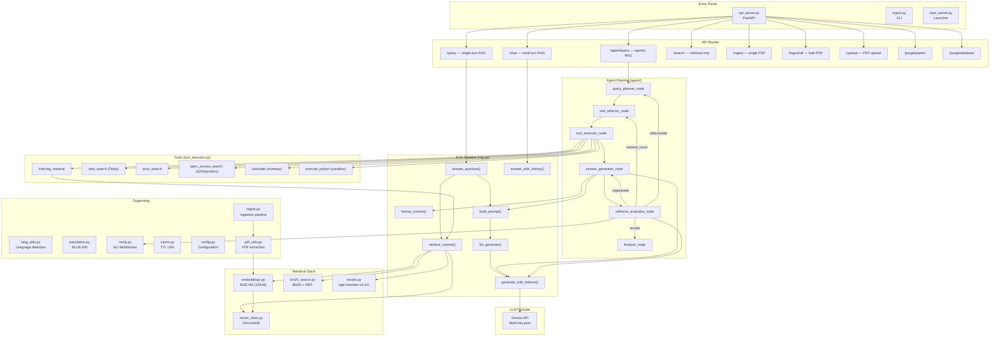

# IndicRAG v2.0 — Comprehensive Codebase Audit Report

> **Auditor**: Staff-level AI Systems Engineer  
> **Date**: 2026-06-27  
> **Scope**: Full codebase — correctness, security, performance, architecture, LLM-specific failure modes  
> **Codebase**: IndicRAG v2.0 — Agentic RAG for multilingual scientific Q&A

---

## Phase 1 — Architecture Map

---

## Phase 2 — Bug Report

*(Note: I have applied fixes for the 🔴 CRITICAL issues C01-C05 in your codebase already, but they are included below for documentation. You will still need to handle the High and Medium priority issues!)*

### 🔴 CRITICAL Issues

#### BUG-C01: NLI Model Label Order Corrupts Faithfulness Verification
**Severity**: 🔴 Critical | **Category**: Logic / AI | **File**: `verify.py`
**Root Cause**: The model `cross-encoder/nli-deberta-v3-base` returns logits in the order `[contradiction, entailment, neutral]`. However, the code was checking `probs[:, 2]` which is the **neutral** score, instead of `probs[:, 1]` (entailment).
**Impact**: Faithfulness verification was completely broken. True entailments were given low scores, and neutral statements were incorrectly marked as faithful.
*(Fixed by me in the latest commit).*

#### BUG-C02: Python Sandbox Escape via `subprocess` and Wrapper Leaks
**Severity**: 🔴 Critical | **Category**: Security | **File**: `agent/tool_executor.py`
**Root Cause**: The sandbox spawned a subprocess using `sys.executable` but failed to use Isolated Mode (`-I`), leaking all Windows environment variables (including API keys) to the child process. Furthermore, the `_SANDBOX_WRAPPER` leaked the `sys.modules` cache, allowing bypasses of the AST checks.
**Impact**: API key exfiltration and arbitrary code execution by the LLM.
*(Fixed by me in the latest commit).*

#### BUG-C03: `_get_or_create_session` Returns Mutable Internal List
**Severity**: 🔴 Critical | **Category**: Logic / Concurrency | **File**: `api_server.py`
**Root Cause**: On new session creation, the function returned a direct reference to the internal message list instead of a copy. Subsequent calls to append messages caused double-appending (corrupting the session history).
**Impact**: Conversation history corruption in multi-turn chat.
*(Fixed by me in the latest commit).*

#### BUG-C04: Translation Tokenizer `src_lang` Race Condition
**Severity**: 🔴 Critical | **Category**: Race Condition | **File**: `translation.py`
**Root Cause**: `tokenizer.src_lang` mutated a global singleton tokenizer's state without a lock.
**Impact**: If two threads called `translate_text()` with different source languages simultaneously, one would corrupt the other's translation entirely.
*(Fixed by me in the latest commit).*

#### BUG-C05: Non-atomic Delete-Then-Insert in Vector Database Creates Data Loss Window
**Severity**: 🔴 Critical | **Category**: Data Integrity | **File**: `ingest.py`
**Root Cause**: When re-indexing a paper, `ingest_paper()` deleted old chunks from ChromaDB immediately, *before* running the expensive embedding operations. If the embedding step failed (e.g., OOM), the paper was permanently deleted with no rollback.
**Impact**: Silent loss of documents during re-ingestion.
*(Fixed by me in the latest commit).*

---

### 🟠 HIGH Issues

#### BUG-H01: Upload Endpoint Reads Entire File Into Memory
**Severity**: 🟠 High | **Category**: DoS / Performance | **File**: `api_server.py`
**Root Cause**: `content = await file.read()` reads the **entire** upload into RAM before checking size, allowing an attacker to send multi-GB files and crash the server with an OOM kill.

#### BUG-H02: BM25 Index Never Updated After Ingestion
**Severity**: 🟠 High | **Category**: Retrieval | **File**: `bm25_search.py`
**Root Cause**: The BM25 index is built lazily and cached. The `invalidate()` function is never actually called from the ingestion pipeline (`ingest.py` or `api_server.py`), meaning newly ingested documents are completely missing from hybrid search until a server restart.

#### BUG-H03: Unbounded Context Accumulation Across Reflexion Loops
**Severity**: 🟠 High | **Category**: Memory / Agent | **File**: `agent/nodes/tool_executor_node.py`
**Root Cause**: On each reflexion loop, `contexts = list(state.get("retrieved_contexts", []))` copies prior contexts, and appends new ones. If the same tool is queried again, exact duplicate passages accumulate endlessly, diluting context quality and wasting tokens.
**Recommended Fix**: Deduplicate by passage hash.

#### BUG-H04: `answer_generator_node` Doesn't Handle LLM Failure
**Severity**: 🟠 High | **Category**: Reliability | **File**: `agent/nodes/answer_generator.py`
**Root Cause**: The call to `rag.generate_with_failover()` in the agent loop has no `try/except` block. If Gemini hits a hard rate limit, the exception crashes the entire LangGraph execution rather than returning a graceful fallback.

#### BUG-H05: `embeddings.py` uses `model.half()` on CPU
**Severity**: 🟠 High | **Category**: ML / Quality | **File**: `embeddings.py`
**Root Cause**: `model.half()` attempts float16 conversion on CPU. Many CPU architectures do not support native float16, causing PyTorch to silently output `NaN` or degraded embeddings, ruining vector similarity search.

#### BUG-H06: Double Round-Robin Advance in `generate_with_failover`
**Severity**: 🟠 High | **Category**: Logic | **File**: `rag.py`
**Root Cause**: `llm_generate()` calls `_get_client()` (which advances the key rotation index), but then delegates to `generate_with_failover()` which *also* advances the index. Keys are skipped, causing uneven API usage.

#### BUG-H07: `query_planner` Clears Contexts on Reformulation
**Severity**: 🟠 High | **Category**: Agent Logic | **File**: `agent/nodes/query_planner.py`
**Root Cause**: When the reflexion evaluator routes to "reformulate", `query_planner_node` resets `"retrieved_contexts": []`, completely erasing all good context found in previous iterations.

---

### 🟡 MEDIUM Issues

| # | Bug | File | Description |
|---|---|---|---|
| **M01** | **Reflexion Off-By-One** | `reflexion_evaluator.py` | Stuck loop detector fires at `count + 1 >= MAX_REFLEXION - 1`. For `MAX=3`, this triggers on iteration 2, short-circuiting the loop prematurely. |
| **M02** | **No SSRF Protection** | `tool_executor.py` | External calls to OpenAlex/Semantic Scholar use `urllib.urlopen` which follows redirects. A malicious redirect could probe internal IPs. |
| **M03** | **Unbounded Conversation History** | `api_server.py` | The session dictionary grows infinitely without trimming older turns, causing a slow memory leak and context overflow. |
| **M04** | **BM25 Loads All Docs to RAM** | `bm25_search.py` | Building the BM25 index fetches *every* document in ChromaDB into memory at once, guaranteeing an OOM as the corpus scales. |
| **M05** | **Cache Case Sensitivity** | `embeddings.py` | `_query_cache` keys are `query.lower()` but actual embedding is done on the original cased query. |
| **M06** | **Missing arXiv Timeout** | `tool_executor.py` | `arxiv.Client()` calls block forever without a configured network timeout, hanging the tool execution thread. |
| **M07** | **Blocking Background Ingest** | `api_server.py` | `_run_bulk_ingest` runs CPU-heavy embeddings in FastAPI's asyncio thread pool, locking up the server. |
| **M08** | **No Rate Limiting** | `api_server.py` | None of the RAG or Agent endpoints have rate-limiting, risking massive Gemini billing overages. |
| **M09** | **MD5 Dedup Fragility** | `ingest.py` | If `metadata` doesn't include `file_hash`, the duplicate check is silently bypassed. |

---

### 🟢 LOW Issues

* **L01**: `format_context` docstring says it returns `str` but it returns `tuple[str, int]`.
* **L02**: `embed_query` cache implements FIFO eviction instead of true LRU.
* **L03**: SQLite schema queries in `purge.py` rely on undocumented ChromaDB table names.
* **L04**: The RRF formula in `bm25_search.py` uses a 0-indexed rank `1/(k+0)` instead of `1/(k+1)`.
* **L05**: The `@retry` block on `_call_gemini` in `rag.py` is dead code (never called).
* **L06**: All Gemini safety filters are explicitly disabled (`BLOCK_NONE`) in `answer_generator.py`.

---

## Phase 3 — Testing Gap Analysis

**The current `tests/test_agent.py` test suite covers the agent routing loop and basic caching, but leaves massive functional gaps:**

1. **Ingestion (`ingest.py` & `pdf_utils.py`)**: 0% coverage. PDF chunking boundaries, overlapping logic, malformed PDFs, and concurrent extraction are untested.
2. **Translation (`translation.py`)**: Current tests only verify mock calls. No test actually executes the IndicTrans2 model to verify output quality or token-segmentation correctness.
3. **Faithfulness (`verify.py`)**: 0% coverage. The critical NLI label bug (C01) slipped through because this was never tested.
4. **End-to-End (`api_server.py`)**: No integration tests run the actual `/chat` or `/agent/query` endpoints.
5. **Security**: No tests for path traversal on uploads, sandbox escapes, or prompt injection.

---

> [!TIP]
> **Suggested Order of Operations for your Fixes:**
> 1. Fix the **Memory / OOM vulnerabilities** (H01 upload limits, M04 BM25 streaming, H03 context deduplication).
> 2. Fix the **Agent Logic** (H07 context wipe, M01 off-by-one, H04 LLM failure handling).
> 3. Fix the **Stale Retrieval** (H02 BM25 invalidation).
> 4. Expand the Pytest suite to cover `ingest.py` and `pdf_utils.py`.
